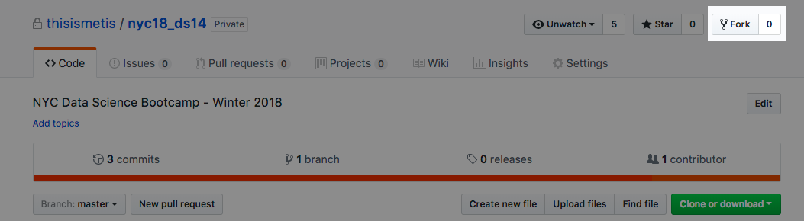
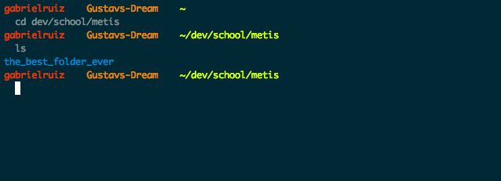
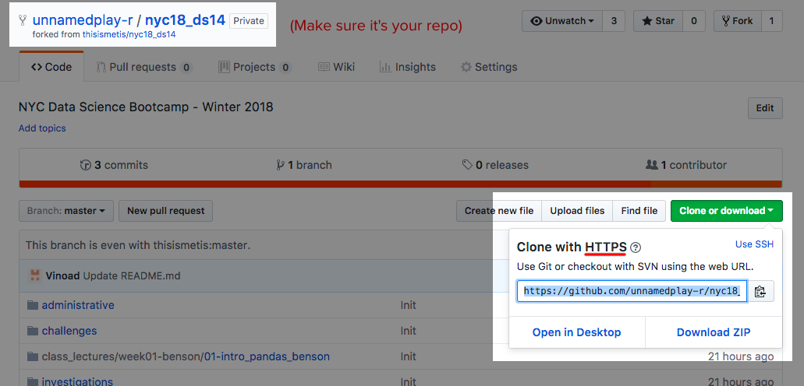
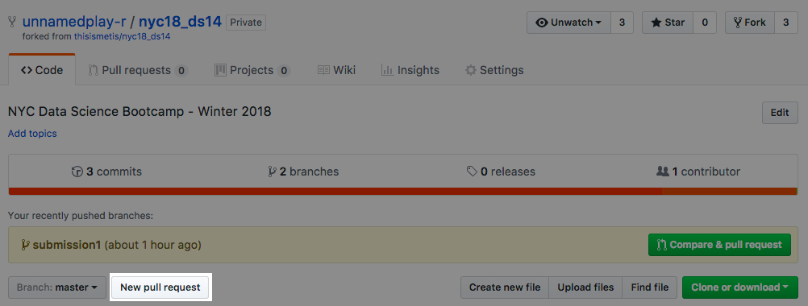
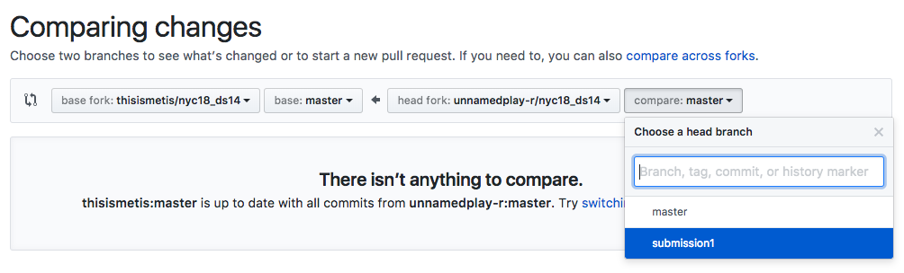
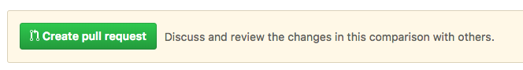
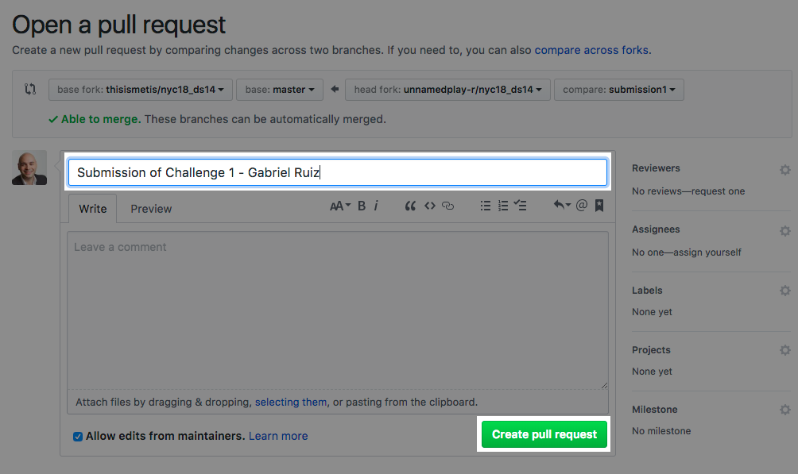
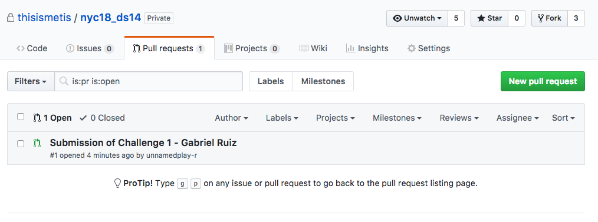

# SSH + Github = ❤️

Before we push on to the bulk of the lecture, we're going to make our lives much simpler by giving us the ability to directly access our repos on Github without typing in our username and password every time we interact with git on the command line. To do this, we'll be using SSH, a cryptographic network protocol.

**Building a pair of SSH keys**  

1. Open up our terminal.
2. Type this into the command line, substituting *your_email@example.com* with the email you use to sign into Github: ```ssh-keygen -t rsa -b 4096 -C "your_email@example.com"``` (-t means what type of encryption, -b the bits, and -C is the comment)
3. When you're prompted to **`Enter a file in which to save the key`**, type in `/Users/yourusername/.ssh/github_rsa` replacing yourusername with the username on your computer.
4. Click enter twice when they ask for a passphrase (this is an extra security layer for SSH that we won't be making use of).

Great, so now if you type `cd ~/.ssh` then `ls`, you should see `github_rsa` and `github_rsa.pub` appear. The `.ssh` folder is the default location where we store our public and private SSH keys. The `github_rsa.pub` file is our public key and the other is our private (**DON'T SHARE THIS ONE**).

**Adding your shiny new SSH key to your GitHub account**

1. Copy the public ssh key into your clipboard: `pbcopy < ~/.ssh/github_rsa.pub` (or if pbcopy isn't working, just use `cat ~/.ssh/github_rsa.pub` and copy the contents).
2. Go to github.com, click your photo, then click settings.
3. On the panel to the left, click **SSH and GPG Keys**.
4. On the top right, click New SSH Key.
5. In the title section, put in a name to help you identify this key later (*Macbook Air - github_rsa.pub*), paste the public key into the list and click save.

**The Leap of Faith**  
Let's see if this worked, type `ssh git@github.com` into the terminal (type yes if either of the warnings pop up). If you get a response like `Hi unnamedplay-r! You've successfully authenticated, but GitHub does not provide shell access.` you should now have SSH access to github, and can forever abandon the idea of typing your username and password into the terminal when interacting with github 🙃 (if this doesn't work, notify me and figure out what happened after the lecture).

Let's get back on track with Git and Github.

# Forking the Course Repo

1. Access the [course repo](https://github.com/unnamedplay-r/nyc18_ds14/tree/master/class_lectures/week01-benson/01-intro_pandas_benson).
2. Click Fork on the top right of the repo.
 
3. After a few seconds you’ll be placed in your new forked repo! Notice how we did this ONLY using Github? Remember what I said, forking is a possibility because of these services made on top of Git.

# Attack of the Clones (aka Cloning the Fork)

1. Open your terminal and bring yourself to a place where you’ll be saving your coursework using the command `cd <directory name>` to change into a directory and `ls` to list the files in your current directory. You can use `mkdir <directory name>` if you want to create a new folder to put the repository.

 

2. Once you’re in a place where you’d like to save this repository, open your browser to your forked repo and click the green button **Clone or download**. Make sure the title says Clone with SSH; if not, click ‘Use SSH` to the right of the header. Copy the link and open the terminal in your location where you want to save your repo and type:
	- `git clone <pasted link>`

 

3. Once it’s finished downloading the git repo from your fork, type `ls` and make sure a folder called nyc18_ds18 is there.

Congrats, you just successfully cloned your first repo! Now, remember that a clone is just simply a *copy of the repo*. Any changes make locally will not be shown in the repo on Github until you **PUSH** it there (we'll go over that) and any changes made on the repo on Github will not be reflected on your local machine until you **PULL** it there. Okay, so now let’s interact with git.

# Our Own Branch of Development

Ok, so one of the first things we spoke of was the working directory. Right now we have loaded the latest commit from the master branch of *our fork*. Lets create our own branch of development so we can make changes without impacting the master branch of development:

1. In the terminal type `git branch submission0`. This creates a new branch which we can see by typing in `git branch`. Two branches will appear are the `master` and `submission0` branches. Master is the main thread of development.
2. Let's move into the new branch we created, type `git checkout submission0`. The command `checkout` allows us to enter into different branches (also other commits!) and changes the contents of our Working Directory to mimic what's inside the branch. It will be the same as the master head since it's a new branch.

# Our First Commit
Remember, the flow of git is between our working directory, the staging area (the things we want to save) and the .git folder (git repo).

1. Let's make some changes by adding in a file that tells us about your favorite food:
	1. `cd student_submissions/challenges/00_practice`
	2. `mkdir lastname_firstname`
	3. `echo "your favorite food here" > faviez.txt` - `>` is a command in bash that means **X** 
2. We just made our first modification to the directory. Let's prepare to save these changes to our git repo.
	1. `git status` - this will reveal the files we can add.
	2. `git add student_submissions/challenges/00_practice/favies.txt` (the filename will depend on where you are in the directory)
	3. `git status` - notice how it moved into the 'Changes to be commited' (aka STAGING) section?
3. Let's make the big leap, let's commit these changes to our repo.
	1. `git commit -m 'submitted first challenge'` - this writes to the repo (the .git FOLDER)
	2. `git status` - notice how our working tree has no modifications in it, and our 'working tree [is] clean'.

So, right now we just created an entirely new node in git's history and officially contributed to a thread of development. You can see your changes by typing in `git log` and see that we added a new commit to the top!

# Push it

If we look at our Github, notice that the the changes we've made on our local machine aren't reflected there. We need to sync our **REMOTE** (github) repo with our local clone.

Lets **PUSH** our branch up to our fork.

- `git push origin submission0`  

`git push` takes 2 arguments here, the remote we want to push to, and the branch. **origin** is the *fork* we have on github. The name defaults to origin and reminds us of the orginal location of where we pulled it from, and submission0 was the branch we created earlier.


# Pull Request

Now it's time to merge our changes with the official Metis repo. To do this, we use a pull request from our submission0 branch into the master branch of development.

1. Go to our fork and click the button 'New Pull Request'. It's next to the 'Branch: master' button and on the same section where the 'Clone and Download' button is.  


2. Click the branch to the right, and click the branch you want to merge (sorry, it was meant to be submission0!):  


3. Click create pull request:  
 

4. Type in a title for the pull request, and click 'Create Pull Request':
 
 
5. If you go into the Metis repo, under the Pull Requests section, you'll now see your pull request there!
 
 
Great, so now we've pulled our submission0 branch into the master branch of development on the Metis repo. But that means now all the other changes the other students are making to the main thread of development aren't reflected in either our fork or our local clone. Let's sync up.

# Pulling from Remotes

Remember, a remote is just a copy of a git repo on another computer (aka a *remote* location). This can take shape as an internal company server, Github, Gitlab, Bitbucket, etc. Let's start our syncing by making sure our local repo knows the location of the Metis repo.

1. Navigate to the main Metis repo and click 'Clone or download' and make sure you're on the SSH version. Copy the link.
2. Open your terminal and make sure you're in the forked repo folder and type:
	- `git remote add upstream git@github.com:thisismetis/nyc18_ds14.git`
3. `git remote -v` - this shows the remotes we have connected to our repo. Notice there are two remotes that have two urls each, that point to different locations. `(fetch)` and `(push)` denote two seperate links that allows us to push code and recieve code from different links (we won't encounter this using Github).
4. `git checkout master` - switch back to the master thread of development.
5. `git pull upstream master` - on the current branch, fetch the latest commits from the Metis repo and merge them into the current thread of development.
6. `git log` - you'll see a bunch of new commits from the others students.
7. `git push origin master` - push all the changes on our master branch to origin (our fork).

If you look at your github, you'll see that your repo now matches what we have on our local machine, and commits have been added from other students!

# Using Git in Class

Git can be a bit hairy to work with when you're using Jupyter notebooks. They often save automatically when opened and cause a lot of issues when you're ready to submit your work to the repo. To mitigate this issue create a branch called `notes`. Whenever you want to take notes in the Jupyter notebooks, you can just add and commit them to this branch. This will be your own branch, something you can continuously pull from master and save to. Feel free to get weird on this branch and try out a bunch of crazy things :3

One note about this. When switching between branches, the Working Directory moves with you. Either simply commit in the notes branch before you move into another one, or `git stash` your work. Git's `stash` is a way of saving your current working directory, making some changes and pulling them up later when you're ready to pick it up again. To pick up where you left off, simple `git stash apply` will get your latest stash back up and running.


## References
- [Atlassian Git Cheatsheet](https://www.atlassian.com/git/tutorials/atlassian-git-cheatsheet) - This is a great reference for git when you're getting started. 
- [SourceTree](https://www.sourcetreeapp.com/) - An amazing GUI for git. It really helps when things get messy, and you want to visually explore the changes your making to your repos.
- [Pro Git](https://git-scm.com/book/en/v2) (aka the Git bible) - Dive deeper and learn more about how git REALLY works. Chapters 1, 2, 3 and 7 are a great place to get aquainted with Git.
