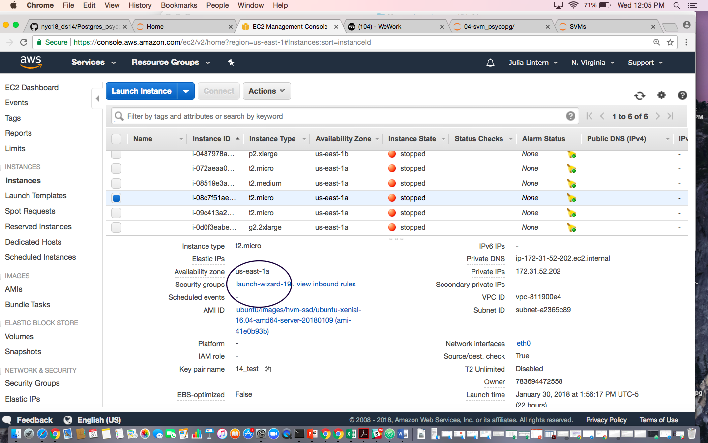

####  Work from home   

#1) Select your EC2.       
#2) Click on Security Groups (launch-wizard-*)   

#3) Either:   
- Update your ip's (Source) to your home ip (choose myip) for SSH, PostGres (what have you)    
- Or add a new a Type -> Click 'Edit'    

