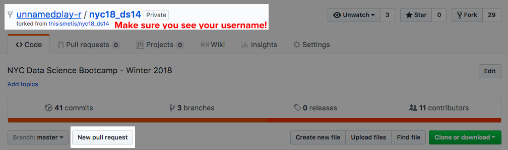
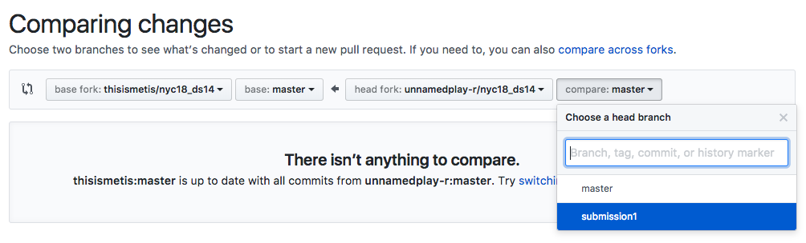
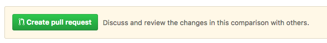
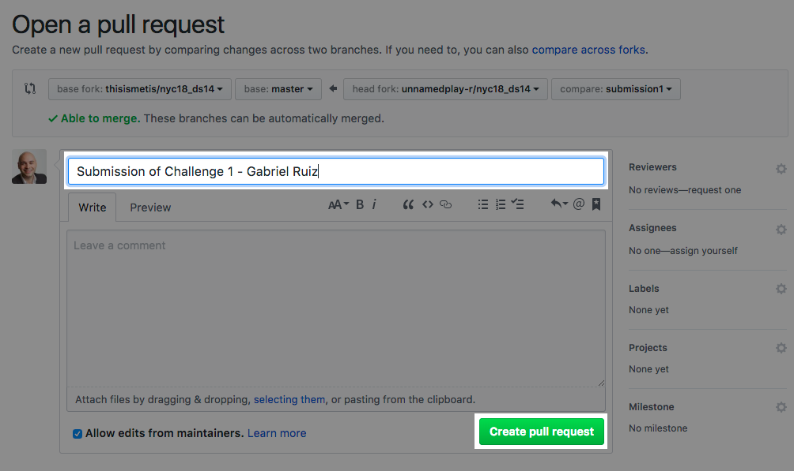
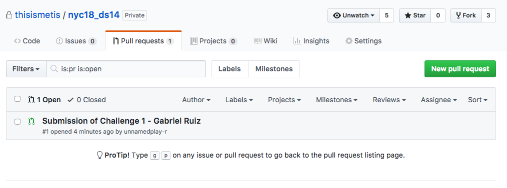

# Git in Class

This resource covers the main activities you'll use Git with, and resolving some problems you might encounter.

- [Pulling Down the Lectures](#pulling-down-the-lectures)  
- [Submitting Classwork](#submitting-classwork)  
- [Fixing the Master Branch](#fixing-the-master-branch)

## Pulling Down the Lectures

1. `git status`, `git branch` - check if you changed anything in your working directory and make note of what branch you're on.
1. `git add <file>` - If you have some files you made changes to, add all of them to staging (use `git add .` to add all of them).
2. `git commit -m "<message here>"`
1. `git checkout notes` - if you're not on the notes branch, bring yourself there.
2. `git pull upstream master`
3. At this point, git will attempt to merge the Metis codebase and your codebase on your branch together. If git managed to do it without a problem, it’ll just ask you to type in a message to describe the merge. I usually just keep the boilerplate message, and escape Vim by pressing ESC, then type: `:wq` then pressing enter. 
	- If there a conflict, you’ll have to resolve it. I’d suggest just renaming the file(s) that are causing the conflict, commit that change, and pull again.

## Submitting Classwork

1. `git checkout master`
	- Move onto the master branch.

2. `git pull upstream master`
	- Make sure our master thread is up to speed with the core Metis repo.

3. `git branch <branch name>`
	- Create a new branch from the now up to date master where I'd suggest using the conventions:
		- project name (ie. `project_benson`)
		- challenge followed by the number (ie. `challenge_2`)
		- investigation followed by the number (ie. `investigation_1`)

4. `git checkout <branch name>`
	- Move onto the branch you just created (make sure when you type `git status` nothing is in the working directory or in staging, if so, just switch back to whatever branch and commit it, or `git stash` it).

5. Add in the files you're submitting to `student_submissions/<investigations, projects, challenges>/lastname_firstname/<your files>`

4. `git add <files>`
	- Add the files to staging

5. `git commit -m "<your helpful summary here>"`
	- Keep these messages brief. Removing the -m option will open up your terminal editor where you can also type in the message there (this will be helpful if you want to expand on your message, see [here](https://chris.beams.io/posts/git-commit/) for more details).

6. `git push origin <your current branch name>`
	- We're pushing your branch onto your fork (`origin`) on Github.

7. Open up **YOUR FORK** on Github, and click 'New Pull Request'.

8. Click the branch to the right, and click the branch you want to merge:  

3. Click create pull request:  
 

4. Type in a title for the pull request, and click 'Create Pull Request':
 
 
5. If you go into the Metis repo, under the Pull Requests section, you'll now see your pull request there!
 
 
## Fixing the Master Branch

You probably just realized that you've been on the master branch this entire time, commiting and writing to it or you might need to submit your work, but you're unsure how to fix your master branch so you're in sync with the Metis repo. Don't fret, this is a pretty easy fix.

If you want to save your current branch's state before doing this (just in case), you can do:

1. `git add <all the files you want to stage>` - we'll be removing all the files in the current working directory in a bit, so if you still have something you want to save there but don't want to commit, `git stash` it.
1. `git commit -m "Saving my work, just in case"`
2. `git branch <branch name>`

**Fetch** the master branch from the main Metis repo, and reset your master branch to look like the Metis repo:   

1. `git fetch upstream`
2. `git reset --hard upstream/master` - this REMOVES EVERYTHING from your staging and your working directory. If you have any unsaved work in the working directory, it will be lost. Be careful here! `git stash` before you do this if you want to save your work!

Your master branch should be the same now as the upstream. From here, you can branch off, and submit your work, or use the new branch to continue the notes you've been making.

If you've pushed the broken master branch to your github repo, I'd suggest cleaning that up too, run:
- `git push origin master --force`

This will force the master branch to have the same history as the fresh and newly updated one on your local machine.
