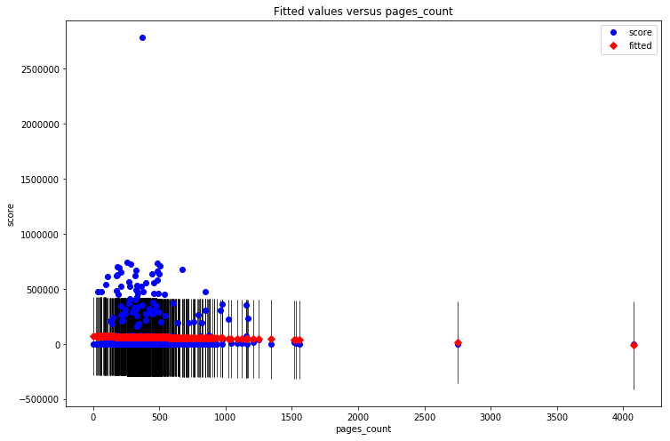

#### Minimum Viable Product

## Analysis of Book Scores on Goodreads

This is a plot of an OLS linear regression model with one feature that investigates the relationship between Goodreads book scores and book page counts.

The figure depicts the model (red) plotted against the actual data points (blue). The prediction confidence intervals are shown as black lines centered at the fitted data points.

The plot suggests that the data contains extreme outliers, and that more features are needed for predicting the score of a book.
