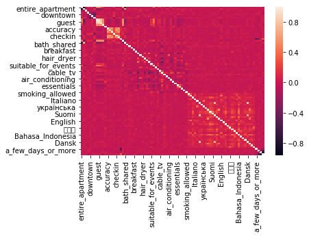
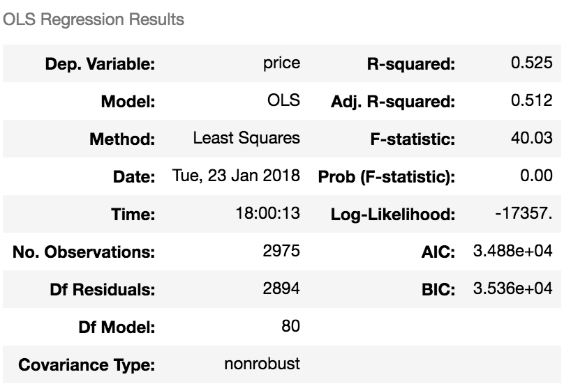

## Analysis of Airbnb postings in Manhattan

I used a linear regression model with all the features to predict the price of Airbnb posting.

The figure is the heatmap of all the variables signifying the correlation between each variables.

This is part of the regression summary ran against all the independent variables. I will use cross-validation and regularization to increase the R-squared.