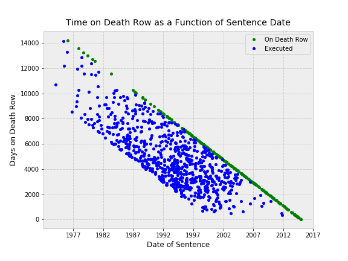

#### Brad Solomon

## Trends in Death Row Incarceration

I pulled data on capital punishment in the United States from the [site](http://www.clarkprosecutor.org/html/death/usexecute.htm) of the Clark County (Indiana) Prosecuting Attorney's office.

The primary variable of interest here is the _time spent on death row_ (from the data of sentencing to execution, in days), and I set out to examine factors that influence it and that may have socioeconomic implications deserving of discussion.

I applied a number of different models, grid searches, and cross-validation methods.  However, one relationship stood out most strongly and dominated the others:

The chart above plots time on death row (in days) as a function of date of sentencing.  The blue points denote executed offenders (on a national basis); the green points are individuals currently on death row in Texas.  (Texas accounts for over 50% of executions on a consistent basis.)

There's a lot going on in the chart:

1. The most immediate observation appears to be a downward trend over time in the forward-looking expectation an offender will have awaiting execution on death row.  This runs counter to conventional wisdom, which (in my opinion) says that criminals are spending "longer than ever" on death row in the present day.  However, there is a key caveat here, one that introduces a bias we cannot fix.  This dataset obsviously excludes a large number of defenders who were recently sentenced, but have not been executed.  (The blue data points are from all 50 states; the green data points are only for Texas.)
2. The almost perfectly linearity of the green line is to be expected--it represents the total number of days elapsed since sentence date until now.  In otherwords, it is a line with a slope of one.
3. What is more interesting is the "bottom" of the scattered points.  The interpretation here might be that _the minimum time one could expect to spend incarcerated on death row_ has decreased monotonically over time.  That is a conclusion that is not subject to the bias mentioned above.
